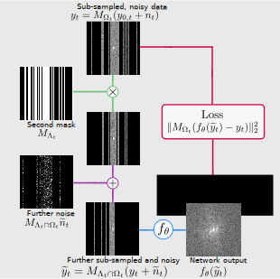

# Robust SSDU
**Simultaneous self-supervised image reconstruction and denoising**

_Charles Millard and Mark Chiew_


This repository reproduces results from our self-supervised reconstruction and denoising [paper](https://arxiv.org/abs/2210.01696).



## Usage 

This repo uses Python 3.9.19. Package dependences can be installed with

```bash 
pip install -r requirements.txt
```

### Training
To train a network, run

```bash
python train_network.py -c <config_name> -d <data_loc> -l <log_loc> 
```
where `<config_name>` is the  name of one of the configuration files in the configs folder, `<data_loc>` is the 
location of the data and `<log_loc>` is the location to save the model and tensorboard summary.

For instance,
```bash
python train_network.py -c default.yaml -d /home/data/fastmri/ -l saved/logs/default/ 
```
trains according to the configuration in the `default.yaml` file, uses data from `/home/data/fastmri/`
and saves the result in the directory `saved/logs/default/`. If an entry in the config file is missing 
the entry from default.yaml will be used automatically.

We have provided example configuration files for the training methods in the paper.


### Testing

To test a network, run 

```bash
python train_network.py -l <log_loc>
```
where log_loc is the location of the saved network. For instance,

```bash
python test_network.py -l saved/logs/default/
```

runs the test script on the model saved in `saved/logs/default/` and saves the results in that directory.


### Data
The code is designed to train on the fastMRI knee or brain dataset, which can be downloaded [here](https://fastmri.org/), 
or the low-field M4Raw dataset, which can be downloaded [here](https://zenodo.org/records/8056074). 

## Contact

If you have any questions/comments, please feel free to contact Charles
(Charlie) Millard at [charliemillard@live.co.uk](charles.millard@ndcn.ox.ac.uk) or Mark Chiew at
[mark.chiew@utoronto.ca](mark.chiew@utoronto.ca)

## Citations
If you use this code, please cite our articles:
```
@article{millard2023theoretical,
  author={Millard, Charles and Chiew, Mark},
  journal={IEEE Transactions on Computational Imaging}, 
  title={A Theoretical Framework for Self-Supervised MR Image Reconstruction Using Sub-Sampling via Variable Density Noisier2Noise}, 
  year={2023},
  volume={9},
  number={},
  pages={707-720},
  doi={10.1109/TCI.2023.3299212}}

@misc{millard2023clean,
      title={Clean self-supervised MRI reconstruction from noisy, sub-sampled training data with Robust SSDU}, 
      author={Charles Millard and Mark Chiew},
      year={2023},
      eprint={2210.01696},
      archivePrefix={arXiv},
      primaryClass={eess.IV}}
```

## Copyright and Licensing

This program is free software: you can redistribute it and/or modify
it under the terms of the GNU General Public License as published by
the Free Software Foundation, either version 3 of the License, or
(at your option) any later version.

This program is distributed in the hope that it will be useful,
but WITHOUT ANY WARRANTY; without even the implied warranty of
MERCHANTABILITY or FITNESS FOR A PARTICULAR PURPOSE.  See the
GNU General Public License for more details.

A copy of the GNU General Public License can be found in the file GNU_General_Public_License,
and is also availabe [here](https://www.gnu.org/licenses/).